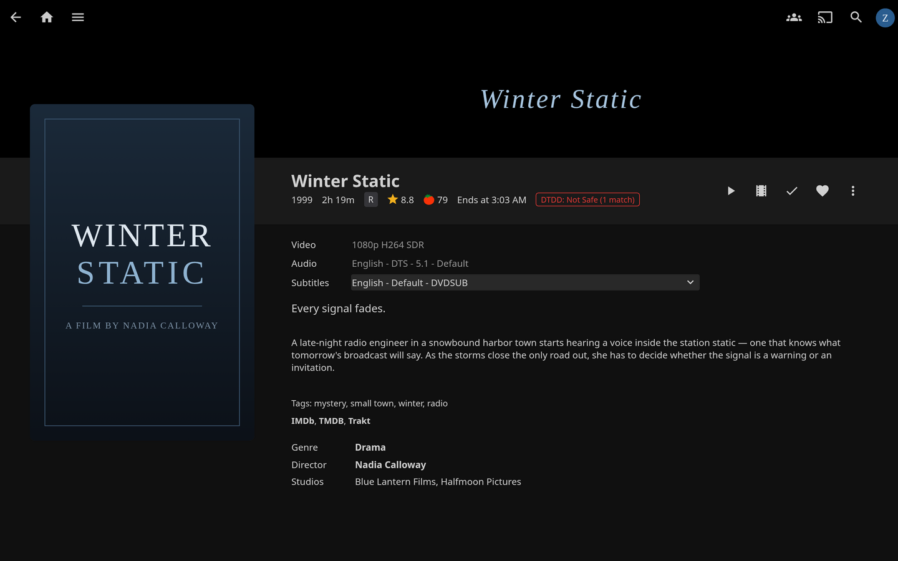
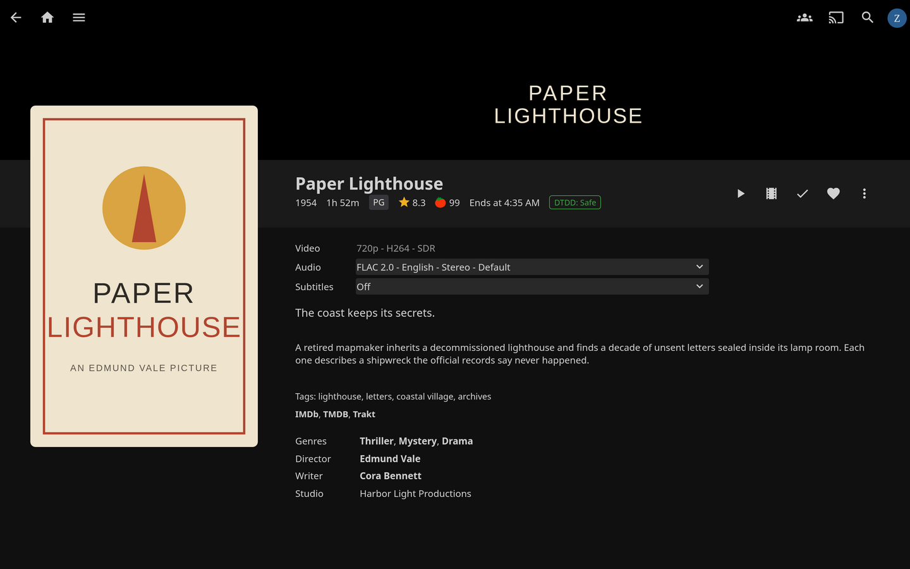
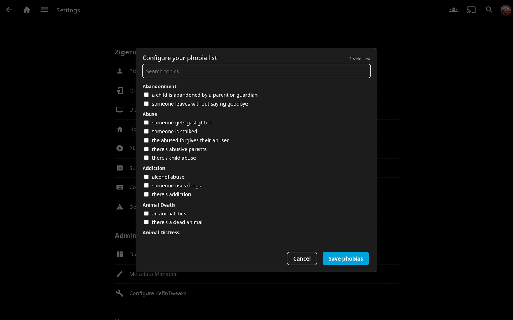

# jellyfin-plugin-dtdd

DoesTheDogDie.com content warnings for Jellyfin, with per-user phobia filtering.

Surfaces a **Safe** / **Not Safe** badge on the item detail page, computed per Jellyfin user from the user's configured phobia topic list. Strict threshold: any single YES vote on any of the user's selected phobias = Not Safe.

## Status

Installable via the Jellyfin plugin catalog (see Install below). Active development; see the Roadmap section for v1.x ideas.

- Plugin GUID: `4479e434-651e-48f7-a2ee-bec0bdadec5e`
- Target Jellyfin ABI: `10.11.0.0`
- .NET target: `net9.0`

## Prerequisites

This plugin requires the [JavaScript Injector](https://github.com/n00bcodr/Jellyfin-JavaScript-Injector) plugin to render the item-page badge. Without it the backend API still works but no UI is rendered.

Install order:

1. JavaScript Injector
2. This plugin

## Install

1. Install [JavaScript Injector](https://github.com/n00bcodr/Jellyfin-JavaScript-Injector) first (required for the UI badge).
2. In Jellyfin: **Dashboard → Plugins → Catalog → ⚙ (gear icon, top-right) → ➕**.
3. Add this repository:

   ```text
   Repository Name: DoesTheDogDie
   Repository URL:  https://zigerus.github.io/jellyfin-plugin-dtdd/manifest.json
   ```

4. Save. The plugin now shows in **Catalog → General → DoesTheDogDie** — click Install.
5. Restart Jellyfin (Dashboard → Settings → General → Restart).

## Configuration

**Admin (one-time):**

1. Get a DoesTheDogDie API key at <https://www.doesthedogdie.com> (free account → request API access).
2. Dashboard → Plugins → DoesTheDogDie → paste API key → save.

**Each user (their own phobia list):**

1. Click your avatar (top-right) → **Settings**.
2. Scroll to **DoesTheDogDie** (under your username's section, alongside Profile / Display / Playback / etc.).
3. Pick the topics you want flagged → **Save phobias**.
4. Open any movie or TV show — the metadata row shows a **DTDD: Safe** / **DTDD: Not Safe (N matches)** / **DTDD: Not in database** badge.

**Library scanning** runs as a weekly task by default. Admins can trigger an immediate scan via Dashboard → Scheduled Tasks → "Prefetch DoesTheDogDie warnings" → ▶.

## Screenshots

_Screenshots are staged with fictional demo titles and original placeholder artwork; the DTDD badge, verdicts, and picker are real plugin output._

**Not Safe** — a topic on the user's phobia list has YES votes on DoesTheDogDie:



**Safe** — the title is in DTDD's database and none of the user's phobias match:



**Per-user phobia picker** — user Settings → DoesTheDogDie:



## Development

### DTDD API usage (since v0.2)

Lookups use API v3 (`/api/v3/items`) via a ladder ordered by measured latency, not aesthetics: `?imdb=` first (~0.1s, hit or miss), `?tmdb=` second (chronically ~15s per call on DTDD's side as of 2026-07, but the only rung that resolves titles DTDD has no IMDB mapping for), then `?name=&releaseYear=` and scored `?q=`. Successful resolutions cache for the configured TTL; full-ladder misses are remembered in memory for 15 minutes so items absent from DTDD don't repay the slow rung on every badge view. The topic catalog seeds from `/api/v3/topics` joined with `/api/v3/topiccategories`; seeder rows are authoritative and refresh existing rows, while topics observed in media payloads only fill gaps. Per-item detail deliberately remains on the v1 `/media/{id}` endpoint: v3's `topicItemStats` omit the per-topic top comment that powers `matchedPhobias[].topComment` (verified against live payloads 2026-07-30). The free API tier allows 30 requests/min and 5,000/month; the prefetch task and library warmer pace themselves at 4.5s per fetched item to stay inside that while leaving headroom for interactive lookups.

### Build

```bash
dotnet build
```

Output DLL: `Jellyfin.Plugin.Dtdd/bin/Debug/net9.0/Jellyfin.Plugin.Dtdd.dll`

### Sideload onto a running Jellyfin server

Releases install via the plugin catalog (see Install above). For fast development iteration — testing changes before tagging a release — the cycle is: build → package → drop the DLL into Jellyfin's plugins dir → restart Jellyfin → verify in Dashboard → Plugins.

The Servarr host (192.168.50.129) runs `lscr.io/linuxserver/jellyfin:latest` with a bind mount at `/home/zigerus/appdata/jellyfin` → `/config`. Jellyfin reads plugins from `/config/data/plugins/` inside the container, which maps to `/home/zigerus/appdata/jellyfin/data/plugins/` on the host filesystem. (Existing plugins like JavaScript Injector and Intro Skipper live here too.)

**One-shot sideload via the helper script:**

```bash
./scripts/sideload.sh
```

The script:

1. Runs `dotnet build -c Release`.
2. Reads `<Version>` from `Directory.Build.props`.
3. Bundles the DLL + a generated `meta.json` into `Jellyfin.Plugin.Dtdd_<version>.zip`.
4. `scp`'s the zip to `servarr:/tmp/`.
5. Unpacks into `/home/zigerus/appdata/jellyfin/data/plugins/DoesTheDogDie_<version>/`.
6. **Stops and prompts for explicit confirmation** before restarting Jellyfin (a production restart interrupts active streams, so it is never automatic).
7. On confirm: `ssh servarr docker restart jellyfin`.

**Manual sideload** (if the script doesn't fit a case):

```bash
# On HP Mini
dotnet build -c Release
VERSION="$(grep -oP '<Version>\K[^<]+' Directory.Build.props)"
mkdir -p /tmp/dtdd-pkg
cp Jellyfin.Plugin.Dtdd/bin/Release/net9.0/Jellyfin.Plugin.Dtdd.dll /tmp/dtdd-pkg/
# write meta.json (see scripts/sideload.sh for the canonical template)
cd /tmp/dtdd-pkg && zip "Jellyfin.Plugin.Dtdd_$VERSION.zip" Jellyfin.Plugin.Dtdd.dll meta.json
scp "Jellyfin.Plugin.Dtdd_$VERSION.zip" servarr:/tmp/

# On Servarr (matches existing parent-dir ownership zigerus:zigerus; container can read it)
ssh servarr "mkdir -p /home/zigerus/appdata/jellyfin/data/plugins/DoesTheDogDie_$VERSION && cd /home/zigerus/appdata/jellyfin/data/plugins/DoesTheDogDie_$VERSION && unzip -o /tmp/Jellyfin.Plugin.Dtdd_$VERSION.zip && rm /tmp/Jellyfin.Plugin.Dtdd_$VERSION.zip"

# Confirm before restarting — this WILL interrupt Jellyfin streams
ssh servarr 'docker restart jellyfin'
```

**Verify the install:** Jellyfin Dashboard → Plugins. `DoesTheDogDie 0.1.0.0` should appear. Jellyfin logs (`docker logs jellyfin --tail 100`) will show plugin load on startup; look for the GUID `4479e434-651e-48f7-a2ee-bec0bdadec5e`.

**Cleanup an old version:** Jellyfin loads every subdirectory under `plugins/`, so when a new version comes in, remove the previous folder to avoid duplicate-instance warnings:

```bash
ssh servarr 'rm -rf /home/zigerus/appdata/jellyfin/data/plugins/DoesTheDogDie_0.0.x'
```

## Known limitations (v1)

- **The DTDD badge in the external-IDs row is populated by a side-effect of `/safety` GET calls and the prefetch task** rather than by Jellyfin's normal metadata-refresh cycle. The plugin writes `ProviderIds["Dtdd"]` once per item the first time a safety lookup or prefetch resolves it. This is a v1 shortcut — v1.x will migrate to a true `IRemoteMetadataProvider<Movie>` / `IRemoteMetadataProvider<Series>` pair so the ID gets written during Jellyfin's normal "Refresh metadata" flow. The shortcut is gated: a ProviderId already on an item (correct or stale) is never overwritten.
- **Prefetch is OFF by default.** Until you enable it on the plugin config page, badges only appear after a user opens an item's detail page (which triggers a safety lookup) — and only for that item. Bulk warming requires flipping the prefetch toggle.
- **Cache is keyed by TMDB ID.** Items in your library without a TMDB ProviderId (rare for movies/TV from standard scanners, common for home videos) still get a live DTDD lookup but don't get cached. Subsequent calls re-hit DTDD.
- **DTDD has no episode-level data** (per-title only). The plugin only operates on Movies and Series; Season and Episode items are ignored.
- **PUT /DTDD/prefs trusts the client.** The picker UI sources topic IDs from `GET /DTDD/topics`, so the only way to send a nonsense ID is direct API access — and unrecognised IDs simply never match anything in the safety lookup (harmless). A 500-element length cap bounds memory from a buggy or malicious caller. See the controller's `PutPrefs` doc comment for rationale.

## Roadmap (post-v1)

- v2: "Why?" modal on the Not Safe badge — clicking the badge opens a modal listing each matched phobia with its top community comment and total comment count. The data is already in the v1 API response; just needs the UI.
- v2: Episode-level data is not available from DoesTheDogDie (per-title only). The comment preview will stay at show/movie granularity.
- v1.x: ship `IRemoteMetadataProvider<Movie>` / `IRemoteMetadataProvider<Series>` so the Dtdd ProviderId gets written during normal metadata refresh and the v1 backfill-on-read shortcut can be removed.
- v3 (blocked on API tier): scene-level trigger warnings during playback — an overlay ~10 seconds before a flagged scene, filtered to the watching user's phobia list, with an offered skip to DTDD's safe-resume point. DTDD's API v3 (`GET /api/v3/items/{id}/ratings`) serves exactly the needed data: trigger timestamp (`position1/2/3` as H:M:S), safe-to-resume timestamp (`safePosition1/2/3`), a spoiler-safe `cueDescription`, and `isSceneAlert: true` on professionally produced entries. Ratings access is tier-gated (verified 2026-07-30): Free = none (403 `upgrade_required` — even on titles the website shows fully unlocked, e.g. John Wick's 52 Scene Alerts, and even filtered to the site's eight "Already Free" severe-trigger topics, so neither site unlock transfers to the API), Startup = community timestamps, Pro+ = Scene Alerts. The $5/month site supporter subscription is a website product; whether it affects the same account's API tier is unstated in the docs. Path forward: DTDD invites early API-tier conversations at licensing@doesthedogdie.com. Delivery would target web-based players first (the injected script already runs there and can track playback position); native clients (Swiftfin, Roku, Kodi) don't execute injected JS and would need a Jellyfin Media Segments fallback, which is per-item rather than per-user.
- ~~v1.x, independent of tier: migrate the client to API v3~~ — **shipped in v0.2**: lookups resolve via an exact ladder (`?imdb=` → `?tmdb=` → `?name=&releaseYear=` → scored `?q=`) and the topic catalog seeds in one pass from `/api/v3/topics` + `/api/v3/topiccategories`. Per-item detail intentionally stays on v1 `/media/{id}` because v3's topic stats omit the per-topic top comment that the v2 "Why?" modal needs; revisit if v3 grows a comment field.

## Built with AI assistance

This plugin was developed collaboratively with [Claude](https://www.anthropic.com/claude) (Anthropic's AI assistant) under direct human supervision. Code generation, debugging, refactoring, and documentation were AI-assisted; architectural decisions, security review, dependency choices, production deployment steps, and the final judgement on every change were reviewed and approved by the human maintainer ([Zigerus](https://github.com/Zigerus)) before landing.

Each commit's `Co-Authored-By` footer marks the model that contributed. The development process — including phase gates, restart approvals, and code reviews — is preserved in the commit history if you want to audit how the plugin was put together.

The AI assistance disclosure is here because transparency matters even on small homelab projects. If you're auditing this plugin for use in your own setup, treat it like any third-party code: read the source, install the JavaScript Injector dependency knowingly, keep your DoesTheDogDie API key private, and decide for yourself whether the trust model is acceptable.

## License

MIT. See [LICENSE](LICENSE).
